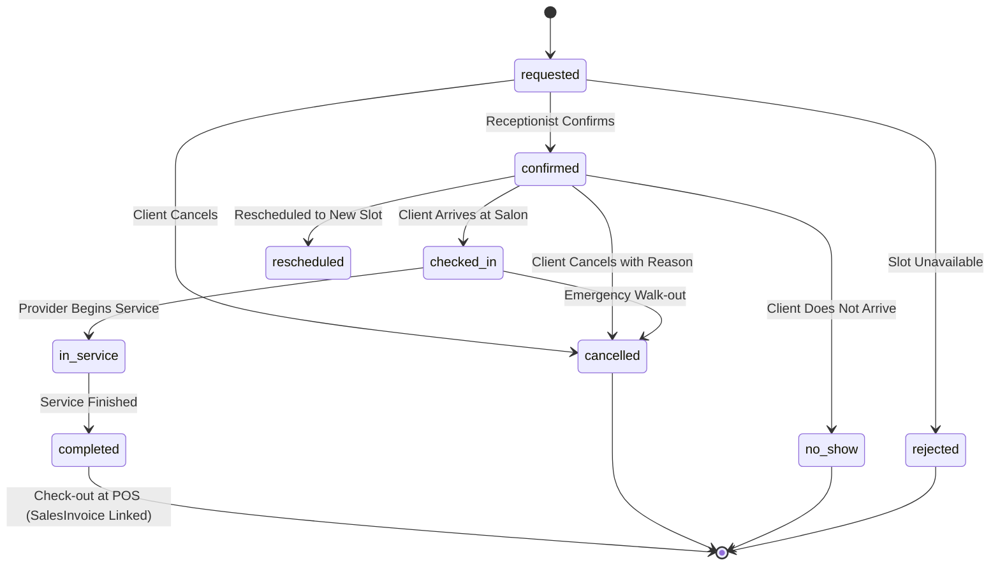

# Seeding Scenarios & Business Simulation Design

This document details the behavioral simulation models, customer segmentation, seasonal variations, daily demand patterns, financial rules, inventory mechanics, edge cases, and deterministic configurations for the 1-Year Development Simulation Engine.

---

## 1. Simulation Parameters & Reproducibility

### 1.1 Timeframe
- **Simulation Anchor Date:** `2026-09-25` (Current system local date)
- **Start Date:** `2025-10-01` (12-month historical window)
- **End Date:** `2026-09-30` (Historical timeline through current date + 5 days near-term operational horizon)
- **Future Booking Window:** `2026-09-26` to `2026-10-10` (14 days of confirmed and requested upcoming bookings)

### 1.2 Deterministic Randomness
- **Global Random Seed:** `20260925`
- The simulation engine uses PHP's `mt_srand(20260925)` and seeded generators (Faker initialized with seed `20260925`).
- Re-running the simulation on a fresh database will generate identical IDs, customer histories, revenue curves, and audit records.

### 1.3 Execution Guard
- **Allowed Environments:** `local`, `testing`, `development`.
- Execution against `production` or `staging` halts immediately with an exception.

---

## 2. Organization, Branches & Scale

### 2.1 Branch Archetypes & Demographics
The business operates 3 distinct physical locations in Cairo:

| Branch Name | Location Archetype | Volume Profile | Staff Count | Workstations | Operating Focus |
|---|---|---|---|---|---|
| **Downtown Flagship** | Urban Commercial Center | High Volume (50% share) | 12 Providers + 2 Cashiers + 1 Receptionist | 8 Styling Stations, 3 Spa Rooms | Full range: Hair, Color, VIP Spa, Aesthetics |
| **Uptown Mall Branch** | Modern High-Traffic Shopping Mall | Medium Volume (35% share) | 8 Providers + 2 Cashiers + 1 Receptionist | 6 Styling Stations, 2 Nail Bars | Quick turnaround: Haircuts, Blowouts, Nails, Grooming |
| **Westside Boutique** | Affluent Residential Suburb | Boutique / High Ticket (15% share) | 5 Providers + 1 Cashier + 1 Receptionist | 4 Private Suites | Luxury services, Bridal, High-end Skincare, Deep Massages |

---

## 3. Staffing & Human Resources Simulation

### 3.1 Staff Tiers & Performance Profiles
Employees are distributed across seniority tiers (`EmployeeLevel`):
- **Master Stylist / Director:** High commission rate (40%), fast service completion, loyal clientele, highest revenue producer.
- **Senior Stylist / Specialist:** Balanced workload (30% commission), steady performance.
- **Junior / Apprentice:** Lower commission (15-20%), longer durations, assists on wash & blowouts.
- **Part-time Specialist:** Available on peak days only (Wed, Thu, Fri, Sat).
- **Terminated Staff Member:** Left the company in month 6 (hiring date: `2025-08-01`, termination date: `2026-03-31`). Has historical appointments and sales before April 2026, but zero activity afterward.
- **New Joiner:** Hired in month 9 (hiring date: `2026-06-01`). Zero activity before June 2026, ramping up to full workload by September.

### 3.2 User Accounts & Role Credentials
For local development and automated testing, deterministic user accounts are created for all operational roles:

| Role | Email | Password | Assigned Branch | Primary Permissions / Scope |
|---|---|---|---|---|
| **Owner / Admin** | `admin@example.test` | `password` | All Branches | Unrestricted full command center, financial reports, settings |
| **Downtown Manager** | `manager.downtown@example.test` | `password` | Downtown Flagship | Branch management, appointments, staff reports |
| **Uptown Manager** | `manager.uptown@example.test` | `password` | Uptown Mall | Branch management, appointments, staff reports |
| **Westside Manager** | `manager.westside@example.test` | `password` | Westside Boutique | Branch management, appointments, staff reports |
| **Downtown Cashier** | `cashier.downtown@example.test` | `password` | Downtown Flagship | Scoped strictly to Downtown POS, sales, and daily close |
| **Uptown Cashier** | `cashier.uptown@example.test` | `password` | Uptown Mall | Scoped strictly to Uptown POS, sales, and daily close |
| **Receptionist** | `receptionist@example.test` | `password` | Downtown Flagship | Appointment calendar, customer booking, check-in |
| **Top Provider (Staff)** | `provider.sara@example.test` | `password` | Downtown Flagship | Own appointment calendar and commission dashboard |

---

## 4. Customer Segmentation & Behavioral Archetypes

A realistic customer base of ~1,200 clients is generated across 6 distinct behavioral cohorts:

### 4.1 VIP & High Lifetime Value (8% of customers, ~95 clients)
- **Characteristics:** Visit frequency every 2-3 weeks; combine multiple high-value services (e.g., Color + Balayage + Treatment); regularly purchase retail aftercare products; maintain prepaid deposit balances ($500 - $2,000); zero unexcused no-shows.
- **Impact on Metrics:** Drives top 20% of revenue, high average ticket ($120 - $250).

### 4.2 Loyal Regulars (25% of customers, ~300 clients)
- **Characteristics:** Predictable appointment frequency (every 3-5 weeks); dedicated to a preferred provider; standard ticket items (haircut, beard trim, recurring manicure).
- **Impact on Metrics:** Stable recurring baseline revenue.

### 4.3 Occasional / Event-Driven (30% of customers, ~360 clients)
- **Characteristics:** 2-4 visits per year; bookings coincide with holidays, weddings, Eid, and New Year's celebrations; higher likelihood of booking packages or full aesthetic preparations.

### 4.4 Churned / Inactive (18% of customers, ~215 clients)
- **Characteristics:** Active during Q4 2025 and Q1 2026, then ceased booking completely (no visits in past 6 months).
- **Impact on Metrics:** Validates inactive customer filters and retention analytics.

### 4.5 New Clients (12% of customers, ~145 clients)
- **Characteristics:** First visit occurred within the last 60 days; mixed conversion to second booking.
- **Impact on Metrics:** Populates new customer acquisition KPIs.

### 4.6 Edge-Case & Problematic (7% of customers, ~85 clients)
- **Characteristics:** Multiple cancellations with documented reasons, 1-2 unexcused no-shows, 1 product return/refund, or outstanding unpaid invoice balances.
- **Impact on Metrics:** Exercises cancellation metrics, no-show reporting, refund logs, and accounts receivable tracking.

---

## 5. Seasonality & Daily Demand Curves

### 5.1 Monthly Seasonality Multipliers
Customer appointment volume and retail sales naturally fluctuate throughout the year:

| Period | Month(s) | Volume Multiplier | Business Drivers |
|---|---|---|---|
| **Fall Baseline** | Oct 2025 – Nov 2025 | 1.00x | Steady post-summer salon routine |
| **Holiday & New Year Rush** | Dec 2025 | 1.45x | Year-end celebrations, styling, high retail gift purchases |
| **Winter Slowdown** | Jan 2026 – Feb 2026 | 0.85x | Post-holiday dip, routine maintenance only |
| **Pre-Ramadan Prep & Mother's Day** | Mar 2026 | 1.25x | Spring treatments, seasonal promotions |
| **Ramadan Period** | Apr 2026 | 0.70x | Reduced daytime hours, evening surge before Eid |
| **Eid al-Fitr Surge** | Late Apr 2026 | 1.60x | Extreme 7-day rush, fully booked schedule |
| **Wedding & Summer Kickoff** | May 2026 – Jun 2026 | 1.30x | Bridal season, hair lightening, manicures, pedicures |
| **Mid-Summer Travel** | Jul 2026 – Aug 2026 | 0.90x | Vacation season, mall branch maintains traffic |
| **Back-to-School & Pre-Fall** | Sep 2026 | 1.20x | Return to routine, hair revitalization after sun/sea |

### 5.2 Day-of-Week Distribution
Weekly traffic adheres to Egyptian retail & salon norms:
- **Thursday & Friday:** Peak volume (1.5x - 1.8x multiplier). Evening slots fully booked.
- **Saturday:** Very high volume (1.4x multiplier). Family and weekend grooming.
- **Tuesday & Wednesday:** Moderate baseline (1.0x).
- **Sunday & Monday:** Quiet days (0.7x). Ideal for deep cleaning, inventory restocking, and staff training.

### 5.3 Daily Hours & Slot Logic
- Salons open at 10:00 AM and close at 9:00 PM (10:00 - 21:00).
- Slot durations are dictated by `services.duration` (e.g. 30 min, 45 min, 60 min, 120 min).
- Provider schedules are conflict-free: an active appointment strictly prevents another booking for the same provider within `[start_date, end_date)` per GAP-002.

---

## 6. Appointment Lifecycle Simulation

Appointments cover the full state machine supported by `App\Enums\AppointmentStatus`:



### 6.1 Status Distribution (Historical Appointments)
- **Completed:** 72% (Converts to active `sales_invoices` with matching service line items and employee commissions).
- **Cancelled:** 11% (Populated with `cancelled_at` timestamp and realistic reasons: "Customer had a work emergency", "Felt unwell", "Rescheduling for next week", "Traffic delay").
- **No-Show:** 5% (Marked after appointment window elapsed without arrival).
- **Rescheduled:** 4% (Preceding record linked to a new confirmed slot).
- **Rejected:** 2% (Provider became unavailable / equipment maintenance).
- **Requested / Confirmed:** 6% (Applicable to near-past, today, and future windows).

---

## 7. Sales, POS & Financial Engine

### 7.1 Invoice Archetypes
- **Service Only (55%):** Customer completed 1 or 2 booked treatments.
- **Mixed Service + Retail (30%):** Customer completed service and purchased home care products (e.g. Kerastase Shampoo, Argan Oil, Beard Balm).
- **Product Only (15%):** Walk-in retail purchase without treatment.

### 7.2 Tenders & Payment Methods
- **Cash Only (50%):** Paid in full via `paid_amount_cash`.
- **Card Only (38%):** Paid in full via credit card / POS terminal (`payment_method_value`).
- **Split Cash + Card (6%):** Part paid in cash, balance on card.
- **Deposit Credit Usage (4%):** Pre-paid customer deposit redeemed against the invoice via `CustomerTransaction`.
- **Unpaid / Outstanding Balance (2%):** Client pays deposit/portion, leaving a positive `balance_due` on account.

### 7.3 Commissions Engine (GAP-003)
- Every service line item in `sales_invoice_details` computes:
  - `commission_type`: `'percentage'` or `'value'` from `service_employees`.
  - `commission_rate`: e.g. 30.00%.
  - `commission_amount`: `(subtotal * commission_rate / 100)`.
  - `is_immediate_commission`: boolean flag.

### 7.4 Invoice Voiding (GAP-004)
- A controlled subset of invoices (~15 invoices) are generated as `status = 'voided'` within the allowable 24-hour window:
  - Audited with `voided_by`, `voided_at`, and `void_reason` ("Customer entered wrong billing profile", "Duplicate POS charge", "Cashier entered incorrect item price").
  - Retail and consumable inventory deductions are properly reversed.

---

## 8. Inventory & Restocking Lifecycle

### 8.1 Inventory Movements
The simulation enforces full ledger reconciliation:
```text
Initial Stock + Purchases - Sales - Service Consumables + Returns ± Adjustments = Current Stock
```

1. **Initial Purchases (Month 1):** Large supplier purchase invoices for each product line.
2. **Monthly Replenishment (Months 2-12):** Periodic supplier deliveries for high-turnover items.
3. **Retail Deductions:** Sales of `sales` type products decrement stock and FIFO `supplier_prices`.
4. **Service Backbar Consumables:** When services with `service_products` associations are completed in active sales invoices, consumable quantities are deducted from the branch inventory.
5. **Stock Adjustments (REQ-018):** Periodic manual inventory counts (~30 adjustments) recording:
   - `count_correction` (minor variance reconciliation)
   - `damage` (broken bottle during salon cleaning)
   - `waste` (expired hair dye mixture)
   - `theft` (unaccounted missing retail item)
6. **Stock Returns (REQ-019):** When a retail product refund is approved with `inventory_restored = true`, stock is returned to the warehouse inventory.

### 8.2 Inventory Alert Thresholds (Dashboard Verification)
To ensure the dashboard displays realistic operational warnings:
- **Out of Stock (Quantity = 0):** 3-5 specific retail products are fully depleted.
- **Low Stock (1 <= Quantity <= 5):** 6-10 products are near depletion.
- **Healthy Stock (Quantity > 10):** All other products have ample inventory.

---

## 9. Operating Expenses Simulation

Each branch incurs realistic monthly fixed overhead and variable operational costs across 8 categories:

| Expense Category | Frequency | Monthly Amount (Downtown) | Monthly Amount (Mall) | Monthly Amount (Boutique) |
|---|---|---|---|---|
| **Rent & Lease** | Monthly (1st of month) | $4,500.00 | $6,000.00 | $3,000.00 |
| **Utilities (Electricity & Water)** | Monthly (10th of month) | $650.00 - $850.00 | $900.00 - $1,100.00 | $400.00 - $550.00 |
| **Salon Cleaning & Sanitation** | Bi-weekly | $200.00 | $250.00 | $150.00 |
| **Equipment Maintenance** | Periodic (every 2-3 months)| $300.00 - $600.00 | $400.00 - $800.00 | $200.00 - $400.00 |
| **Marketing & Social Ads** | Monthly | $500.00 - $1,200.00 | $400.00 - $800.00 | $300.00 - $600.00 |
| **Salon Consumables & Tea/Coffee**| Weekly | $120.00 - $180.00 | $150.00 - $220.00 | $100.00 - $150.00 |
| **Software & POS Subscriptions** | Monthly (5th of month) | $150.00 | $150.00 | $150.00 |
| **Staff Refreshments & Misc** | Monthly | $100.00 - $250.00 | $120.00 - $280.00 | $80.00 - $180.00 |

---

## 10. Live Current-Day Scenario (2026-09-25)

The dashboard command center requires vibrant, real-time activity for `today`:
- **8 Appointments Today across branches:**
  - 3 `completed` with linked POS sales invoices.
  - 1 `in_service` (currently in progress with Stylist Sara).
  - 1 `checked_in` (client waiting in reception).
  - 2 `confirmed` (scheduled for this afternoon).
  - 1 `requested` (pending receptionist confirmation).
- **Today's Financials:** Active cash and card sales invoices generating non-zero revenue, visible on KPI cards and revenue trend charts.
- **Operational Alerts:** 1 pending requested appointment, 4 low-stock alerts, 2 out-of-stock items requiring reorder.
- **Recent Audit Activity:** 10+ events logged today (invoices created, client check-in, inventory adjustment, customer registered).
